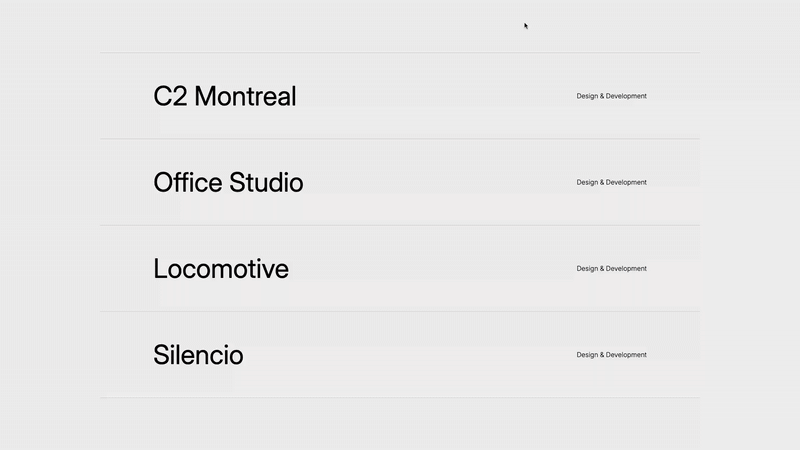

# Project Gallery with Animated Custom Cursor

A sleek React project gallery with an animated custom cursor and modal previews. This project demonstrates advanced CSS animations and React hooks for smooth tracking effects



[Live Demo](https://floriansimunek.com/projects/mousehovergallery) | [Github Repository](https://github.com/floriansimunek/Mouse-Hover-Gallery) | [Inspiration](https://dennissnellenberg.com/)

## Features

- Elegant project listing with hover effects
- Custom cursor that follows mouse movement with smooth animation
- Modal preview that appears on hover with a delayed tracking effect
- Responsive image display for each project

## Technical Implementation

This project showcases several advanced front-end techniques:

- **Custom cursor tracking** using `requestAnimationFrame` for optimal performance
- **Smooth animations** with linear interpolation (lerp) for natural movement
- **CSS transitions** for elegant scaling and transformations
- **React Hooks** for state management and effect handling
- **Pure CSS animations** without relying on external animation libraries

## Project Structure

```
project-gallery/
├── src/
│   ├── components/
│   │   ├── Modal/
│   │   │   ├── index.js
│   │   │   ├── Modal.jsx
│   │   │   └── Modal.module.css
│   │   ├── Project/
│   │   │   ├── index.js
│   │   │   ├── Project.jsx
│   │   │   └── Project.module.css
│   ├── App.jsx
│   ├── App.module.css
│   └── main.jsx
└── public/
    └── assets/
        ├── c2montreal.png
        ├── officestudio.png
        ├── locomotive.png
        └── silencio.png
```

## How It Works

### Custom Cursor Animation

The project implements a custom cursor with a delayed tracking effect using:

- `requestAnimationFrame` for smooth animation at optimal frame rates
- Linear interpolation (lerp) function to create natural easing effects
- Different tracking speeds for the modal, cursor, and label

```javascript
// Linear interpolation function for smooth movement
function lerp(start, end, factor) {
  return start * (1 - factor) + end * factor;
}
```

### Modal System

The modal system shows previews of projects on hover:

- Tracks mouse position with a slight delay for a more natural feel
- Scales in/out with CSS transitions
- Displays project images from a predefined list

### Project Listing

Project items feature subtle animations on hover:

- Text elements slide in opposite directions
- Opacity changes provide visual feedback
- Border styling creates clear separation between items

## Key Technologies

- React
- CSS Modules
- JavaScript Animation API (requestAnimationFrame)
